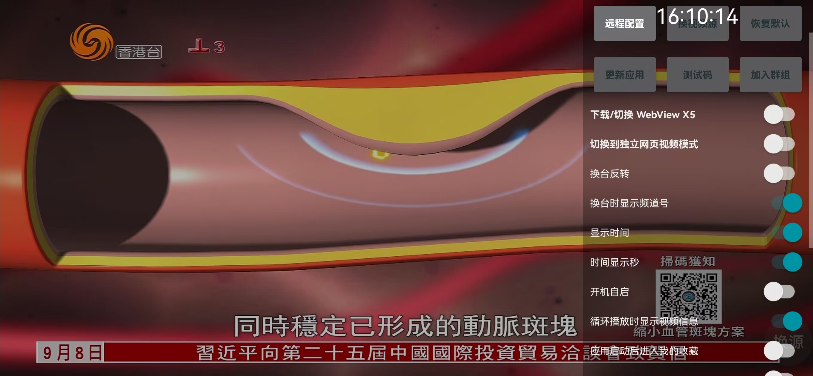

## 🌐 語言 / Languages

- [🇨🇳 中文說明](README.md)
- [🇺🇸 English Version](README.en.md)
# Your TV：Android Live TV APK
Support Android 6.0 (API23) and above<br>
Combines the functions of my-tv/my-tv-0/my-tv-1/mytv-android/WebViewTVLive and other projects.<br>
IPTV/web video player android APK software, customizable sources(
(Supports webview:// format web video source)), <br>
IPTV supports picture-in-picture and off-screen playback.<br>
[yourtv](https://github.com/horsemail/yourtv)
<br>
# <span style="color:red; font-weight:bold;">‼️For testing only. After testing, please delete in 24 hours.‼️ </span><br>
# <span style="color:red; font-weight:bold;">‼️Forwarding to any platform in mainland China is strictly prohibited.‼ ️Please delete immediately if already published‼️ </span><br>
### 🔴 **Please read the [Instructions](#use) carefully. **
## Online encryption and decryption: (TVBox-compatible interface source encryption and decryption)
https://yourtvcrypto.horsenma.net<br>
The encryption and decryption logic is identical to the project.<br>

Telegram Group<br>
https://t.me/yourtvapp<br>
<br><br>
=<br>
For mobile phones, it is best to enter the settings interface to switch to soft decoding, otherwise some live sources will have no sound. <br>
<br><br>
<br><br>
<br><br>
## Update History<br>
### Updated on July 4, 2025<br>
Significantly improved live source to achieve seconds loading analysis<br>
Fixed other bugs<br>
### Updated on July 2, 2025<br>
Support Android 6.0 IPTV<br>
May support Android 6.0 Webview (not tested)<br>
Fix various BUGs<br>
### Updated on June 30, 2025<br>
Fixed and enhanced support for Android 6.0 (API-23) and above<br>
Fixed other bugs<br>
### Updated on June 22, 2025<br>
Added live source information interface<br>
-Long press or continuous click on TV to confirm/4 times on the center button to trigger)<br>
-Long press on the lower right virtual switch source button on the phone to trigger<br>
-Retain the original long press or continuous click on the right button 4 times to enter the settings interface<br>
Switch live source to display the current line/bus line<br>
Optimize the test code input UI/try to keep the same style of multiple interfaces<br>
Multi-language support full repair<br>
Fix other bugs/may bring new bugs<br>
### Updated on June 20, 2025<br>
Released V1.8.3<br>
Restored the "Exit APP" switch<br>
Added a long press or quick press 4 times to confirm/center/right button to trigger the display of the settings interface<br>
(Solved the problem that the settings interface could not be displayed on devices without menu keys)<br>
Fixed other bugs<br>
### Updated on June 17, 2025<br>
Released V1.8.2
Added full screen stretch display mode<br>
Fixed other bugs<br>
### Updated on June 15, 2025<br>
IPTV can load the default WEBVIEW source.<br>
Fixed multi-language support.<br>
Various optimizations and bug fixes.<br>
### 2025 年 6 月 13 日更新<br>
支持包含webview和IPTV混合源的直播源文件<br>
webview:// https://xxx 及类似源和 https://abc.com/cctv1.m3u8 混合源<br>
### Updated on June 11, 2025<br>
Released version 1.7.7<br>
Fixed the issue of no sound when playing on mobile phones of some channels/invalid soft decoding switch<br>
Each time the valid test code is downloaded, the live source is directly updated<br>
(The original logic uses the cache within 24 hours without downloading)<br>
The test code can only be entered once within 10 minutes<br>
### Updated on June 9, 2025<br>
Released version 1.7.6<br>
Added automatic version detection<br>
Fixed live source file switching bug<br>
Fixed version number calculation<br>
Optimized channel parsing logic<br>
Significantly reduced the time to load live source files<br>
### Updated on June 7, 2025<br>
Added live source file caching and switching functions<br>
The first line of the Menu shows the live source file switching<br>
Triggered by clicking the live source file name more than 4 times<br>
### Updated on June 4, 2025<br>
Improved UI, unified and transparent<br>
Optimized IPTV parsing logic<br>
Fixed various bugs<br>
Other experience optimization<br>
### Updated on June 3, 2025<br>
Cancel the interface for switching between web video and IPTV independently。<br>
Change to the switch in the settings interface.<br>
Fix the problem of parsing custom live sources.<br>
Fix other bugs.<br>
### Updated on June 2, 2025<br>
Added support for Tencent Webview X5
Fixed various bugs<br>
Optimized the experience<br>
### Updated on May 30, 2025<br>
Released version v1.7.1
Fixed various bugs
### Updated on May 29, 2025<br>
Simple integration of webview web video, some settings are not perfect<br>
No optional function of Tencent webview X5 yet<br>
May be added in the future<br>
### Updated on May 20, 2025<br>
Fixed the issue of losing focus on the TV settings interface<br>
Fixed the issue where the TV menu group/channel interface loses focus and does not automatically focus on the currently playing channel<br>
### Updated on May 18, 2025<br>
Improve the playback auto-recovery logic in picture-in-picture mode to be consistent with full screen<br>
Sponsored authors are changed to join the group<br>
Delete historical commits/tags, clean up github, and only keep the latest version. <br>
### Updated on May 17, 2025<br>
Added background playback on touch screen devices with the screen turned off, and added a background playback switch in the settings interface. <br>
### Updated on May 15, 2025<br>
Fixed various BUGs in using cloudflare's D1 and R2 to store information and live source files<br>
Introduced Android's security key mechanism to protect data<br>
Fix the problem of stopping the playback of picture-in-picture<br>
Fix the problem of updating the application version and downloading unsmoothly<br>
Delete some unnecessary display information to reduce visual interference<br>
### Updated on May 13, 2025<br>
Newly adopt cloudflare's D1 and R2 to store test code information and encrypted live source files<br>
Improve the live source loading experience<br>
The original github repository storage is reserved as a backup and fallback mechanism<br>
The version is changed to 1.6<br>
### Updated on May 9, 2025<br>
Fix proxy socks5 Proxy download<br>
Fix the problem of soft decoding settings being invalid after restarting the APP<br>
Fix the problem of picture-in-picture being cropped<br>
### Updated on May 8, 2025<br>
Improve the cold start experience<br>
Before initialization is completed, prohibit user operations including prohibiting entry into picture-in-picture. <br>
The touch screen only enters the picture-in-picture when the system home button is entered. Cancel the return key to enter the picture-in-picture. <br>
<br>
### Updated on May 6, 2025<br>
Added picture-in-picture function<br>
Added a "Change Source" virtual button to hide the touch screen in the settings<br>
Added proxy download GitHub API<br>
### Updated on May 5, 2025<br>
Improved the boot experience and added a stable source<br>
Added settings to automatically update the live source settings every day<br>
### Updated on April 30, 2025<br>
Combined the above updates<br>
Fixed the bug of automatically switching the live source to avoid abnormal switching<br>
### Updated on April 29, 2025<br>
Added a device binding test code, one test code can bind up to 5 devices<br>
Added a test code binding information backup mechanism<br>
### Updated on April 28, 2025<br>
Enter the content to be converted here. Test code verification is placed at the original exit button of the settings interface<br>
Add automatic source change settings<br>
Apply update correction, try to provide automatic uninstall and manual update without success, direct update is effective<br>
Optimize the order of boot playback source selection, record the stable source played by the user as the boot source<br>
The live source used by the test code is not displayed in any interface such as history record<br>
Optimize the logic of all downloaded files, especially the download of github private warehouse files, reduce delays, and improve the experience<br>
Improve the problem of APP jamming when entering the first use, and delay the download of online live sources<br>
The confirmation of the smooth addition of the live source of CCTV 1 ensures smooth playback when entering the first use<br>
### Updated on April 26, 2025<br>
Temporarily delete the test code verification mechanism and boot screen, and directly enter the default playback. <br>
Improve the experience<br>
<br>
### Updated on April 24, 2025<br>
Fix the function of updating applications in the settings interface<br>
<br>
### Updated again on April 23, 2025<br>
Restore the custom live source address and other button functions in the settings interface. <br>
### Updated on April 23, 2025<br>
Added default live source, <br>
Solved the problem that when there are few groups, the TV cannot select groups and channels when entering the menu menu<br><br>
### Updated on April 21, 2025<br>
Live source resource address supports github private warehouse<br>
### Emergency update on April 21, 2025<br>
Fixed: <br>
When the touch screen collection group is not empty, the group cannot be switched. <br>
There is also an error when the mobile phone has a browser update download. <br>
Long press the touch screen to change the live source, and the program list should be displayed. <br>
<br>
### The first official release was on April 21, 2025. Instructions for use:<br>
The APP itself can automatically switch the live source, and you can also switch the live source manually. <br>
<br>
## Use

TV:<br>
1. Turn on the TV and download the live source resources. Please wait patiently for 5-30 seconds.<br>
2. Confirm/center key: pop up the group/channel list, select the group/channel up, down, left, and right, confirm the selected channel, right key to collect/cancel collection<br>
3. Up/down key: switch channels<br>
4. Left key: display program list information<br>
5. Right key: switch different live source addresses of the same channel<br>
6. Long press the menu key, or quickly press the menu key multiple times to display the settings interface<br>
7. Switch IPTV/web video: Settings interface--Switch IPTV/Switch web video switch<br>
8. Other functions, test them yourself. <br>

<br>
Touch screen:<br>
1. Turn on the device and download live source resources. Please wait patiently for 5-30 seconds.<br>
2. Swipe up and down on the left side: adjust brightness<br>
3. Swipe up and down on the right side: adjust sound<br>
4. Swipe in the middle: switch channels<br>
5. Bipolar screen: pop up group/channel list, click to select, click heart to collect/cancel collection<br>
6. Continuously and quickly click the screen: display the settings interface<br>
7. Click the virtual source change key: switch live source (APP will also automatically switch live source according to the freeze situation), the settings interface can turn on and off the display of virtual keys<br>
8. Long press the touch screen: display the current channel program list<br>
9. Press the home page (mobile phone virtual circle key) key to enter picture-in-picture<br>
10. The touch screen can still play when the screen is turned off (there is a cancel switch in the settings interface)<br>
11. Switch IPTV/web video: Settings interface--Switch IPTV/Switch web video switch<br>
12. Other functions, test them yourself. <br>

* After opening the configuration, select remote configuration, scan the QR code to configure the video source, etc. You can also directly configure the address remotely http://0.0.0.0:34567
* After turning on "Automatically update live source every day", the live source will be automatically updated after the application is started
Note:

* If you encounter a problem, you can first consider restarting/restoring to default/clearing data/reinstalling to solve it yourself

Download and install [releases](https://github.com/horsemail/yourtv)

Note that "*-kitkat" is an Android 4.4 compatible version

More download addresses

## Others

It is recommended to install via ADB:

```shell
adb install YourTV.apk
```

Xiaomi TV can be installed using Xiaomi TV Assistant

## Frequently Asked Questions

* Why does the video source text return to the original configuration after opening the app again after configuring it remotely? <br>

If "Update video source after app launch" is turned on and the video source address exists, it will be automatically updated, which may overwrite the saved video source text. <br>

* Notes for compiling APP by yourself: <br>
1. Resource files need to be confirmed one by one and set to their own information, especially cloudflare.txt/github_private.txt/sources.txt<br>
Need to use the encryption and decryption tool website https://yourtvcrypto.horsenma.net to encrypt and store. <br>
2. The APK file I uploaded may not be synchronized with the source code. The APK file is relatively new, and the source code update is generally a few days behind. Please check it carefully. <br>
3. The encryption and decryption logic used in the APK file I uploaded is different from the encryption and decryption logic in the project: https://yourtvcrypto.horsenma.net, in order to protect my private resource information. <br>

## Thanks

[live](https://github.com/fanmingming/live)<br>
[my-tv-0](https://github.com/lizongying/my-tv-0)<br>
[my-tv-1](https://github.com/lizongying/my-tv-1)<br>

## Apologies

I don't understand code, let alone development. I am just doing this to kill time. All codes are implemented by AI.
I don’t know how to use many functions on github yet.
