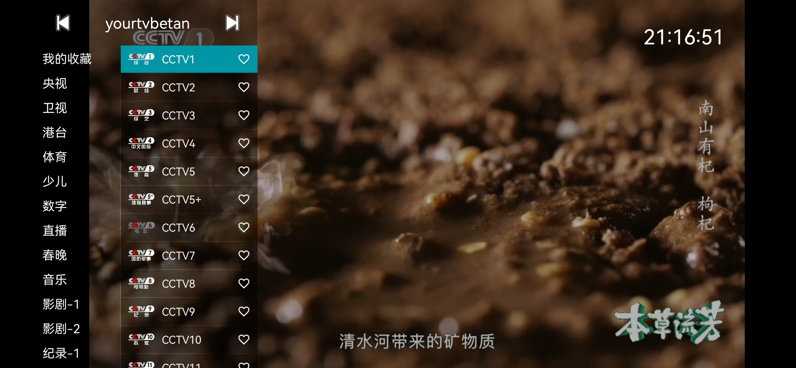
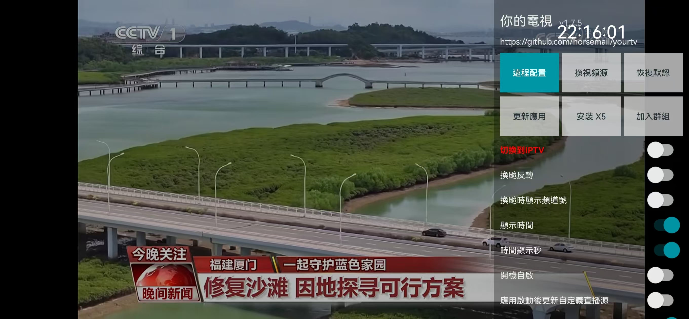
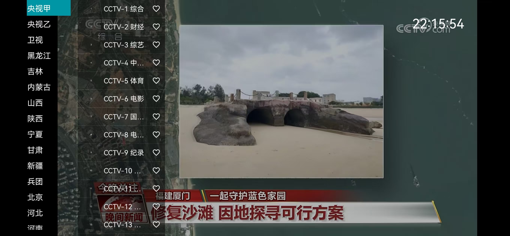

## 🌐 語言 / Languages

- [🇨🇳 中文說明](README.MD)
- [🇺🇸 English Version](README.en.md)
# 你的電視：安卓電視直播APK
支持安卓6.0(API23)級以上版本
綜合my-tv/my-tv-0/my-tv-1/mytv-android/WebViewTVLive等項目的功能。  
IPTV/網頁視頻播放安卓APK軟件，支持腾讯webview x5，内置数千直播源，可自定義源(支持webview://格式網頁視頻源)，IPTV支持畫中畫和熄屏播放。
[yourtv](https://github.com/horsemail/yourtv)
<br>
僅供測試，測試完，請及時刪除。<br>
### 🔴 **請仔細閱讀後面的[使用說明](#使用)。**
## 在線加密解密：（兼容Tvbox的接口源加密解密）
https://yourtvcrypto.horsenma.net<br>
與項目內加密解密邏輯完全一致<br>
<br>
## 測試碼
默認硬解碼版，適合電視機等硬件解碼比較好的設備。<br>
手機使用，最好進入設置界麵切換為軟解碼，否則有的直播源會沒聲音。<br>
### 🔴 **如需測試碼，請加入TG群組，群組內公開測試碼/或自動髮放/或申請提供。**<br>
## 電報群組
https://t.me/yourtvapp<br><br>
<br><br>
<br><br>
<br><br>
<br><br>
<br><br>
<br>
## 更新歷史
###  2025年6月30日更新<br>
修複和增強對安卓6.0（API-23）及以上版本的支持<br>
修複其它BUG<br>
###  2025年6月22日更新<br>
增加直播源信息界麵<br>
-電視長按或連續點擊確認/中心鍵4次觸髮）<br>
-手機顯示右下虛擬換源鍵後長按即可觸發<br>
-保留原來長按或連續點擊右鍵4次進入設置界麵<br>
切換直播源顯示目前線路/總線路<br>
優化測試碼輸入UI<br>
多語言支持全麵修複<br>
修複其它BUG<br>
###  2025年6月20日更新<br>
V1.8.3版本髮佈<br>
恢複“退出APP”開關<br>
增加長按或快按4次確認/中心/右鍵，觸發顯示設置界面<br>
（解決沒有菜單鍵設備無法顯示設置界面的問題）<br>
修複其它BUG<br>
###  2025年6月17日更新<br>
V1.8.2版本髮佈
增加全屏拉伸顯示模式<br>
修複其它BUG<br>
###  2025年6月15日更新<br>
IPTV可加載默認的WEBVIEW源。<br>
修復多語言支持。<br>
各種優化和BUG修複。<br>
###  2025年6月13日更新<br>
支持直播源文件中包含webview和IPTV混合源<br>
webview:// https://xxx类似的源和https://abc.com/cctv1.m3u8混合源<br>
###  2025年6月11日更新<br>
發布1.7.7版本<br>
修複部分頻道手機播放無聲音/軟解碼開關無效<br>
有效測試碼下載直播源每次輸入都直接更新<br>
（原邏輯24小時內使用緩存不下載）<br>
測試碼限製10分鐘內隻能輸入一次<br>
###  2025年6月9日更新<br>
發布1.7.6版本<br>
增加自動檢測版本<br>
修復直播源文件切換BUG<br>
修正版本號計算<br>
优化频道解析逻辑<br>
大幅减少加载直播源文件时间<br>
###  2025年6月7日更新<br>
增加直播源文件緩存和切換功能<br>
Menu菜單第一行顯示直播源文件切換<br>
連續點擊直播源文件名4次以上觸髮<br>
###  2025年6月4日更新<br>
修複UI畫麵，統一化和透明化<br>
IPTV解析邏輯優化<br>
修複各種BUG<br>
其他體驗的优化<br>
###  2025年6月3日更新<br>
取消獨立切換網頁視頻/IPTV的界麵。<br>
修改到設置界麵的開關。<br>
修複自定義直播源解析失敗。<br>
修複其他BUG。<br>
###  2025年6月2日更新<br>
增加騰訊Webview X5支持
修複各種BUG<br>
優化體唸<br>
###  2025年5月30日更新<br>
發布v1.7.1版本<br>
修復各種BUG<br>
###  2025年5月29日更新<br>
簡單集成webview網頁視頻，部分設置功能未完善<br>
暫未有騰訊webview X5可選功能<br>
未來可能加入<br>
###  2025年5月20日更新<br>
修復電視機設置界面焦點丟失<br>
修復電視機菜單組/頻道界面焦點丟失，不自動定位焦點到當前播放頻道的問題<br>
###  2025年5月18日更新<br>
改善畫中畫模式下播放自動恢復邏輯與全屏一致<br>
贊助作者改為加入群組<br>
刪除歷史commit/tag，清理github，隻保留目前最新的版本。<br>
###  2025年5月17日更新<br>
增加觸摸屏設備熄屏後台播放，設置界面增加後台播放開關。<br>
### 2025年5月15日更新<br>
修復使用cloudflare 的D1和R2存儲信息和直播源文件的各種BUG<br>
引入安卓的安全密鑰機制保護數據<br>
修復畫中畫播放停止<br>
修復更新應用版本判斷和下載不流暢<br>
刪除部分非必要顯示信息，減少觀看視覺干擾<br>
###  2025年5月13日更新<br>
全新採用cloudflare的D1和R2存儲測試碼信息和加密的直播源文件<br>
改善直播源加載體驗<br>
原來的github倉庫存儲保留為備份和回退機制<br>
版本改爲1.6<br>
###  2025年5月9日更新<br>
修复代理socks5 Proxy下载<br>
修复软解码设置重启APP后失效<br>
修复画中画被裁剪<br>
###  2025年5月8日更新<br>
改善冷启动开机体验<br>
初始化完成前，禁用户操作包括禁止进入画中画。<br>
触摸屏仅进入系统主页按钮时，才进入画中画。取消返回键进入画中画。<br>
<br>
###  2025年5月6日更新<br>
增加画中画功能<br>
设置中增加隐藏触摸屏的“换源”虚拟按钮<br>
增加代理下載GitHub API<br>
###  2025年5月5日更新<br>
改善開機體驗，增加穩定源<br>
增加設置每天自動更新直播源設置<br>
###  2025年4月30日更新<br>
綜合前述更新內容<br>
修複自動切換直播源的BUG，避免非正常切換<br>
###  2025年4月29日更新<br>
新增設備綁定測試碼，一個測試碼最多綁定5颱設備<br>
新增測試碼綁定信息備份機製<br>
###  2025年4月28日更新<br>
在這裡輸入要轉換的內容測試碼驗証放在設置界麵的原來退出按鈕處<br>
增加自動換源設置<br>
應用更新修正，嘗試提供自動卸載和手動更新未成功，直接更新有效<br>
開機播放源選擇順序優化，紀錄用戶播放的穩定源為開機使用源<br>
測試碼使用的直播源不在歷史紀錄等任何界麵顯示地址<br>
優化所有下載文件的邏輯，特別是github私有倉庫文件的下載，減少延遲，提高體驗<br>
改善首次使用進入APP卡頓問題，延遲下載在線直播源<br>
中央一颱直播源確認流暢的加入，保証首次使用進入流暢播放<br>
###  2025年4月26日更新<br>
暫時刪除測試碼驗証機製和開機畫麵，直接進入默認播放。<br>
提高體驗<br>
<br>
###  2025年4月24日更新<br>
修復設置界麵的更新應用的功能<br>
<br>
###  2025年4月23日再更新<br>
恢復自定義直播源地址和設置界麵其他按鈕功能。<br>
###  2025年4月23日更新<br>
增加默認直播源，<br>
解決組少的情況下，電視機進入menu菜單無法操作選擇組和頻道的問題<br><br>
###  2025年4月21日更新<br>
直播源資源地址支持github私有倉庫<br>
###  2025年4月21日緊急更新<br>
修複：<br>
觸摸屏收藏組不為空時，無法切換組。<br>
手機有瀏覽器更新下載也出錯。<br>
長按觸摸屏換直播源，本應該顯示節目單。<br>
<br>
###  2025年4月21日第一次正式發佈，使用說明：<br>
APP本身有自動切換直播源，你也可以手動切換直播源。<br>
<br>
## 使用

電視機：<br>
1、開機使用，下載直播源資源，請耐心等待5-30秒，<br>
2、確定/中心鍵：彈出組/頻道清單，上下左右選擇組/頻道，確定選擇頻道，右鍵收藏/取消收藏<br>
3、上鍵/下鍵：切換頻道<br>
4、左鍵：顯示節目單信息<br>
5、右鍵：切換同一頻道的不通直播源地址<br>
6、長按菜單鍵，或快速按多次菜單鍵，顯示設置界麵<br>
7、切換IPTV/網頁視頻：設置界面--切換IPTV/切換網頁視頻 開關
8、其他功能，自己測試。<br>

<br>
觸摸屏：<br>
1、開機使用，下載直播源資源，請耐心等待5-30秒，<br>
2、左邊上下滑屏：調節亮度<br>
3、右邊上下滑屏：調節聲音<br>
4、中間部分滑屏：切換頻道<br>
5、雙極屏幕：彈出組/頻道列表，點擊選擇，點擊愛心收藏/取消收藏<br>
6、連續快速點擊屏幕：顯示設置界麵<br>
7、點擊虛擬換源健：切換直播源（APP也會根據卡頓情況自動切換直播源），設置界面可開關顯示虛擬鍵<br>
8、長按觸摸屏幕：顯示當前頻道節目單<br>
9、按主頁（手机虚拟圆圈键）键进入画中画<br>
10、触摸屏熄屏仍可播放（设置界面有取消开关）<br>
11、切換IPTV/網頁視頻：設置界面--切換IPTV/切換網頁視頻 開關
12、其他功能，自己測試。<br>

* 打開配置后，選擇遠程配置，掃描二維碼可以配置視頻源等。也可以直接遠程配置地址 http://0.0.0.0:34567
* 打開“每天自動更新直播源”后，應用啟動后會自動更新直播源

注意：

* 遇到問題可以先考慮重啟/恢復默認/清除數據/重新安裝等方式自助解決

下載安裝 [releases](https://github.com/horsemail/yourtv)

注意，“*-kitkat”為安卓4.4兼容版本

更多下載地址

## 其他

建議通過ADB進行安裝：

```shell
adb install YourTV.apk
```

小米電視可以使用小米電視助手進行安裝

## 常見問題

* 為什麼遠程配置視頻源文本後，再次打開應用後又恢復到原來的配置？<br>

  如果“應用啟動后更新視頻源”開啟後，且存在視頻源地址，則會自動更新，可能會覆蓋已保存的視頻源文本。<br>

* 自己編譯APP注意事項：<br>
  1、資源文件需要自己逐個確認設置為自己的信息，特別是cloudflare.txt/github_private.txt/sources.txt<br>
  需使用加密解密工具網站 https://yourtvcrypto.horsenma.net  加密後存儲。<br>
  2、我上傳的APK文件與源碼可能不同步，APK文件比較新，源碼更新一般落後幾天，請注意查看，<br>
  3、我上傳的APK文件使用的加密解密邏輯與項目內加密解密邏輯：https://yourtvcrypto.horsenma.net  不同，目的保護我的私有資源信息。<br>

## 感謝

[live](https://github.com/fanmingming/live)<br>
[my-tv-0](https://github.com/lizongying/my-tv-0)<br>
[my-tv-1](https://github.com/lizongying/my-tv-1)<br>

## 致歉

本人並不懂代碼，更不懂開發，純粹現在空閒愛好打發時間。所有代碼都AI實現。
github上很多功能也還不會用。
